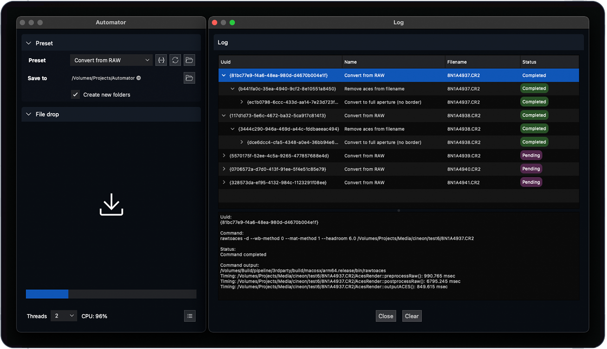

#  Automator #

[](https://github.com/mikaelsundell/automator/blob/master/README.md)

Introduction
------------



Automator is a user-friendly Mac application designed for batch processing files according to predefined job descriptions. It enables the creation of tool chains for drag-and-drop processing, streamlining workflows for efficiency and ease of use. The application boasts a straightforward drag-and-drop interface for file submission, monitoring and job control.

|  Download        | Description |
| ----------------| ----------- |
|  [ Automator v1.0.0](https://github.com/mikaelsundell/automator/releases/download/release-v1.0.0/Automator_macOS12_arm64_release.dmg) | [Apple Silicon macOS12+](https://github.com/mikaelsundell/automator/releases/download/release-v1.0.0/Automator_macOS12_arm64_release.dmg)
|  [ Automator v1.0.0](https://github.com/mikaelsundell/automator/releases/download/release-v1.0.0/Automator_macOS12_x86_64_release.dmg) | [Intel x86_64 macOS12+](https://github.com/mikaelsundell/automator/releases/download/release-v1.0.0/Automator_macOS12_x86_64_release.dmg)


Documentation
-------------

**Getting Started**

Begin by selecting a preset, then drag and drop your files onto the designated file drop area within Automator. The application will automatically commence processing your files in accordance with the chosen preset's specifications and associated tasks.

**Understanding preset file format**

A preset file articulates a sequence of tasks to be executed during file processing. It allows for the specification of commands, file extensions, arguments, and initial directories. Additionally, it supports the definition of dependencies among tasks using the dependson attribute, enabling complex processing chains.

Here's an example of a preset file format, tailored for converting camera RAW files:


```shell
{
  "name": "Convert image using sips",
  "tasks": [
    {
      "id": "@1",
      "name": "Convert to JPEG",
      "command": "sips",
      "extension": "jpg",
      "arguments": "-s format jpeg %inputfile% --out %outputdir%/%outputbase%.%outputext%",
      "startin": "",
      "documentation": [
        "sips -s format jpeg inputfile --out outputfile",
        "Converts the input file to JPEG format using the sips command",
        "-s format jpeg: Specifies the format to convert to",
        "--out: Specifies the output file path"
      ]
    },
    {
      "id": "@2",
      "name": "Adjust JPEG quality",
      "command": "sips",
      "extension": "jpg",
      "arguments": "--setProperty formatOptions 80 %outputdir%/%outputbase%.%outputext%",
      "dependson": "@1",
      "documentation": [
        "sips --setProperty formatOptions 80 outputfile",
        "Adjusts the JPEG quality to 80 (out of 100)",
        "--setProperty formatOptions: Sets the JPEG quality level"
      ]
    },
    {
      "id": "@3",
      "name": "Generate thumbnail",
      "command": "sips",
      "extension": "jpg",
      "arguments": "--resampleWidth 200 %outputdir%/%outputbase%.%outputext% --out %outputdir%/%outputbase%_thumbnail.%outputext%",
      "dependson": "@2",
      "documentation": [
        "sips --resampleWidth 200 outputfile --out thumbnailfile",
        "Generates a thumbnail by resizing the width to 200 pixels",
        "--resampleWidth: Specifies the width of the thumbnail",
        "--out: Specifies the output file path for the thumbnail"
      ]
    }
  ]
}

```


**Supported Variables**

Preset files support various variables that can be used to customize arguments during processing. These variables are dynamically replaced based on the context of the input and output files.

**Input Variables:**

```shell
%inputdir%         Replaces the variable with the directory path of the input file.
%inputfile%        Replaces the variable with the full path of the input file.
%inputext%         Replaces the variable with the file extension of the input file.
%inputbase%        Replaces the variable with the base name (filename without extension) of the input file.
````

**Output Variables:**

```shell
%outputdir%        Replaces the variable with the directory path of the output file.
%outputfile%       Replaces the variable with the full path of the output file.
%outputext%        Replaces the variable with the file extension of the output file.
%outputbase%       Replaces the variable with the base name of the output file.
````

Each variable is designed to simplify the scripting and automation within preset configurations, ensuring that file paths and details are handled efficiently without manual specification in every command.


Automator Advanced
--------

## Build configuration ##

To initiate the build process, use the following command in your terminal, specifying either debug or release mode according to your requirements:


```shell
./build.sh debug|release
```

For deployment into a Disk Image (DMG), include the --deploy flag along with your selected build mode. This step packages the application into a DMG file, suitable for distribution or installation on macOS systems:

```shell
./build.sh debug|release --deploy
```

Web Resources
-------------

* GitHub page:        https://github.com/mikaelsundell/automator
* Issues              https://github.com/mikaelsundell/automator/issues

Copyright
---------

**3rdparty libraries acknowledgment and copyright notice**

This product includes software developed by third parties. The copyrights and terms of use of these third-party libraries are fully acknowledged and respected. Below is a list of said libraries and their respective copyright notices:

App icon: Copyright flaticon.com

The Qt Company Ltd.: Copyright (C) 2016 by The Qt Company Ltd. All rights reserved.

The use of the above-mentioned software within this product is in compliance with the respective licenses and/or terms and conditions of the copyright holders. The inclusion of these third-party libraries does not imply any endorsement by the copyright holders of the products developed using their software.

